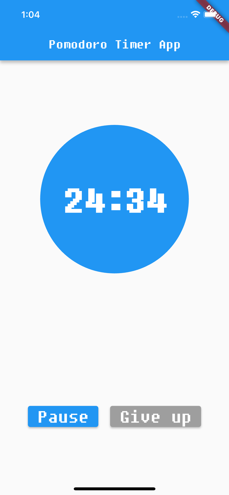

# flutter_pomodoro_timer

# 북리스트 어플 데모 (BookList App Demo)

이 레포지토리는 Flutter를 사용하여 개발된 뽀모도로 타이머 앱의 데모 버전입니다. (뽀모도로 기법은 집중력 향상과 휴식 시간의 효율적인 관리를 도와주는 시간 관리 방법론)
기본 타이머 기능으로 작업 시간과 휴식 시간 25분과 5분으로 작동합니다. 

## < App Screenshot >

  
  
  

